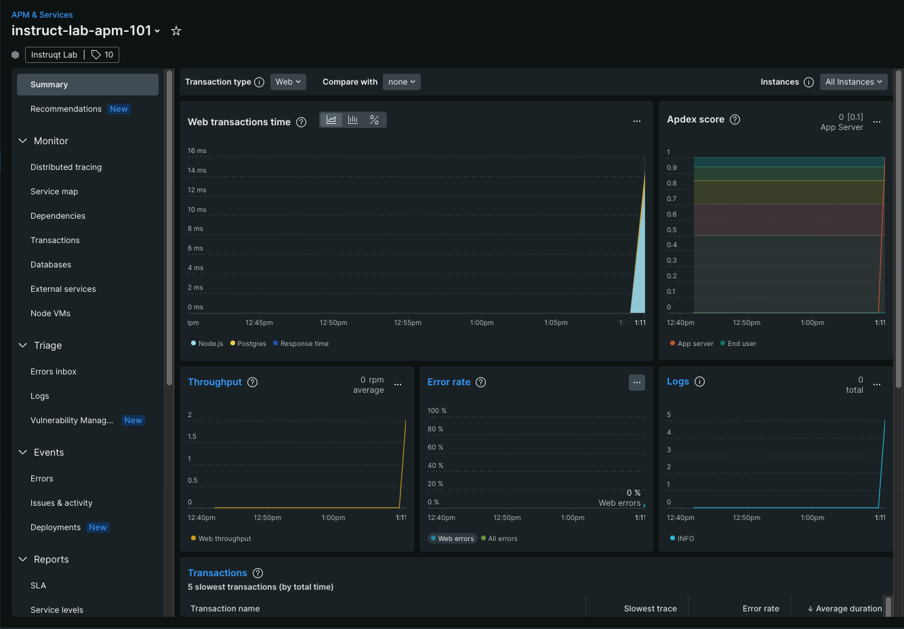

While you were waiting on the loading screen a moment ago, Instruqt was deploying the environment used in this workshop on the Linux VM you are accessing via this page.

This is what Instruqt did behind the scenes:
- Installed Java 21, Maven, and PostgreSQL, which are needed for this workshop.
- Cloned all the files from GitHub for this workshop.

***

Now that the deployment has been completed, run the following commands to validate all the required modules are installed and set up properly.

Verify Node & NPM
=================
Node.js is needed for this workshop for the frontend app.

Run the following cmd in [button label="Terminal 1"](tab-0), and you should see **v22.x.x**.

```run
node -v
```

Run the following cmd in [button label="Terminal 1"](tab-0), and you should see **v10.x.x**.

```run
npm -v
```


Verify Java & Maven
=================
Run the following cmd in [button label="Terminal 1"](tab-0), and you should see **21.x.x**.

```run
java -version
```

Run the following cmd in [button label="Terminal 1"](tab-0), and you should see **Apache Maven 3.6.x**.

```run
mvn -v
```

***

- run ``ls`` to see all the files in this Java app were cloned properly from Github.

***

Start & Verify your Java API service
=================
Now, Run the following cmd in [button label="Terminal 1"](tab-0) to start the application and seed the database.

```run
./manage-java.sh seed && ./manage-java.sh start
```

Switch to [button label="LoadGen Terminal"](tab-1) & test your Java server. by running the command you will get the URL, open this in a new tab

```run
echo http://$HOSTNAME.$_SANDBOX_ID.instruqt.io:5182/api/tutorials/categories
```

Should return JSON in response
```json
[{"id":"1","category":"Frontend Development"},{"id":"2","category":"Backend Development"}]
```

> [!IMPORTANT]
> Once you have **validated** that the deployment has gone well, proceed to next step. If you encountered issues /or the environment is not properly set up, stop the server by pressing `Ctrl+C` in [button label="Terminal 1"](tab-0), return to the home screen of this lab, exit the current session, and redeploy the workshop.

Instrumenting Java application with APM
=================

In the previous section, we simply verified our application. Now, its time to instrument it

### Step 1 - Install the New Relic Java Agent

> [!NOTE]
> There are multiple ways to install the New Relic Java agent. This lab uses the manual zip download, but you can explore other options in the [Java agent install docs](https://docs.newrelic.com/install/java/) or read the [Java agent introduction](https://docs.newrelic.com/docs/apm/agents/java-agent/getting-started/introduction-new-relic-java/) for an overview of all approaches.

If your server is still running, stop it by pressing `Ctrl+C` in [button label="Terminal 1"](tab-0).

Then run the following cmd in [button label="Terminal 1"](tab-0) to download the agent,
```run
curl -O https://download.newrelic.com/newrelic/java-agent/newrelic-agent/current/newrelic-java.zip
```

```run
unzip newrelic-java.zip -d /root/
```

---
### Step 2 - Configure the New Relic Agent

Set up the required environment variables for New Relic monitoring.

Run the following cmd in [button label="Terminal 1"](tab-0),
```copy,run
export NEW_RELIC_APP_NAME="java-tutorials-server"
```

```copy,run
export NEW_RELIC_DISTRIBUTED_TRACING_ENABLED=true
```

```copy
export NEW_RELIC_LICENSE_KEY=<YOUR INGEST LICENSE KEY>
```


> [!IMPORTANT]
> Replace `<YOUR INGEST LICENSE KEY>` with your actual New Relic license key from your New Relic account.

---
### Step 3 - Start the Instrumented Java Service

Now start your Java service with New Relic monitoring enabled using the `-javaagent` flag.

Switch to [button label="Terminal 1"](tab-0) and run:
```run
export JAVA_TOOL_OPTIONS="-javaagent:/root/newrelic/newrelic.jar"
mvn spring-boot:run
```

The New Relic agent will automatically instrument your Java application when it starts up.

---
### Step 4 - Generate Traffic & Test Data

Switch to [button label="LoadGen Terminal"](tab-1) & generate some API traffic to create monitoring data.

Generate continuous load to create more monitoring data:
```run
npx load-generator --workers 4 --pause 500 http://$HOSTNAME.$_SANDBOX_ID.instruqt.io:5182/api/tutorials http://$HOSTNAME.$_SANDBOX_ID.instruqt.io:5182/api/tutorials/categories
```

You can also test other endpoints:
```run
curl http://$HOSTNAME.$_SANDBOX_ID.instruqt.io:5182/api/tutorials/categories
```

> [!NOTE]
> Press `Ctrl+C` to stop the load generation when you have enough data.

---
### Step 5 - Verify APM in New Relic

Head to **New Relic > APM & Services**. If everything is configured correctly, you should see an entity with the name **"java-tutorials-server"** under the **APM & Services** screen in New Relic.

You should see:
- Transaction traces from your API calls
- Database queries (PostgreSQL)
- Response times and throughput metrics
- Error rates and performance data

> [!NOTE]
> Please wait a few minutes for the service to appear in New Relic UI. It may take 2-5 minutes for data to start appearing.



---
### Step 6 - Query Your APM Data with NRQL

New Relic stores all telemetry as queryable events. Open the [Query Builder](https://one.newrelic.com/data-exploration) and try:

```sql
SELECT average(duration), count(*)
FROM Transaction
WHERE appName = 'java-tutorials-server'
FACET name
SINCE 10 minutes ago
```

This shows your top endpoints by request count and average response time — the same data powering the APM charts, but now fully queryable. Any data in New Relic can be queried this way, enabling custom dashboards and alert conditions.

> [!NOTE]
> `Transaction` is the event type the Java agent reports for every web request. Try replacing `FACET name` with `FACET request.method` to see a breakdown by HTTP method.

---
### Step 7 - Error Tracking, Logs in Context & Custom Attributes

The Java agent can capture errors with full context — stack traces, custom attributes, linked logs, and distributed traces — all correlated in one place.

The app includes a demo error endpoint. Trigger it a few times from [button label="LoadGen Terminal"](tab-1):

```run
for i in {1..5}; do curl -s http://$HOSTNAME.$_SANDBOX_ID.instruqt.io:5182/api/tutorials/demo-error; echo; done
```

This endpoint deliberately:
- Throws a `RuntimeException` and calls `NewRelic.noticeError(e)` to report it to New Relic
- Adds two **custom attributes** (`error.type` and `error.endpoint`) that appear in the error detail view
- Logs the error at `ERROR` level, which the agent links to the trace via **Logs in Context**

#### Find the error in New Relic

1. Go to **APM & Services > java-tutorials-server**
2. Click **Errors Inbox** in the left sidebar
3. Click into the error group to open the detail view. You should see:
   - **Stack trace** — the full Java exception and call stack
   - **Attributes** tab — `error.type` and `error.endpoint` custom attributes visible here
   - **Logs** tab — the `ERROR` log lines linked to this exact trace
   - **Distributed trace** — the full request span showing where the error originated
