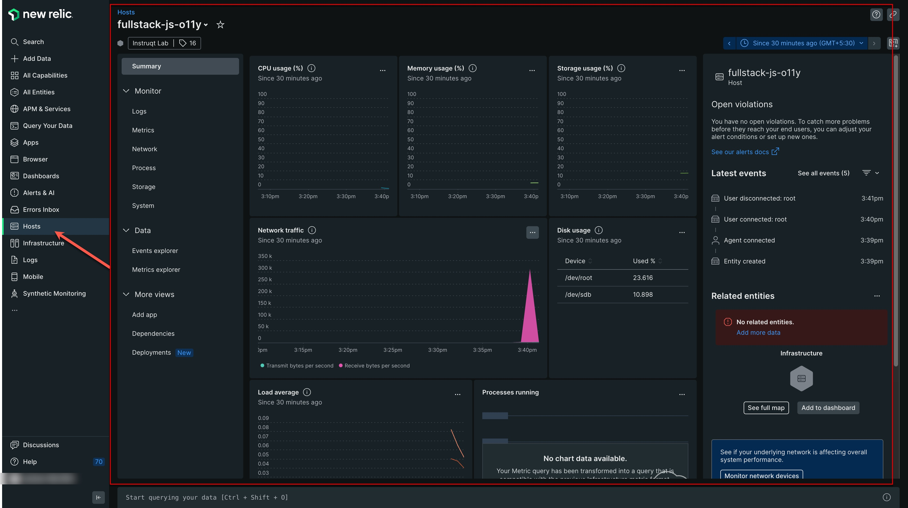

In this challenge, we will set up an Infrastructure Monitoring agent. While there are multiple ways to install and deploy the agent automatically, we will configure it manually to give you a better understanding of how things work.

Step 1 - Setup the Infrastructure configuration file
=

Create a file named **newrelic-infra.yml**, run the command below in the tab [button label="Terminal"](tab-0).

```run
echo "license_key: <YOUR_LICENSE_KEY>" | sudo tee -a /etc/newrelic-infra.yml
```

Switch to the tab [button label="Editor"](tab-1) and add your New Relic License key.

Replace __"<YOUR_LICENSE_KEY>"__ with your own New Relic **INGEST** License in the file.

Save the file, by clicking the save icon under the Editor tab.


Step 2 -  Add the infrastructure agent repo to our APT repository
=

Copy paste the following command in the Terminal, this will download the **newrelic-infra** repo and add it to our list of repos under __/etc/apt/__

```run
sudo curl -fsSL https://download.newrelic.com/infrastructure_agent/gpg/newrelic-infra.gpg | sudo gpg --dearmor -o /etc/apt/trusted.gpg.d/newrelic-infra.gpg
```

Step 3 - Enable the repo
=

Now that we have added the repo to list, we will enable the repo to install the agent.

```run
echo "deb https://download.newrelic.com/infrastructure_agent/linux/apt/ jammy main" | sudo tee -a /etc/apt/sources.list.d/newrelic-infra.list
```

Step 4 - Install the New Relic Infrastructure agent
=

Run the commands below to install the agent.

```run
sudo apt-get update -y
sudo apt-get install newrelic-infra -y
```

Step 5 - Verify the installation
=

Let's verify the installed agent service before we proceed.

```run
systemctl | grep newrelic-infra.service
```

A successful output should show as seen here.

```nocopy
newrelic-infra.service            loaded active running     New Relic Infrastructure Agent
```

Step 6 - Verify your Infrastructure data in New Relic
=

Head over to your New Relic account and click on the ***Host*** option in the side panel on the left and you should see an entity named ***fullstack-o11y-java***

> [!NOTE]
> It may take up a few minutes before the data is shown on the dashboard



---

Step 7 - Query Your Infrastructure Data with NRQL
=

New Relic stores all infrastructure telemetry as queryable events. Open the [Query Builder](https://one.newrelic.com/data-exploration) and run:

```sql
SELECT average(cpuPercent), average(memoryUsedPercent)
FROM SystemSample
WHERE hostname = 'fullstack-o11y-java'
TIMESERIES SINCE 10 minutes ago
```

This is the same data powering the Hosts UI — but now fully queryable, so you can use it in custom dashboards and alert conditions.

> [!NOTE]
> `SystemSample` is the event type the Infrastructure agent reports to New Relic every 5 seconds. Try `FACET hostname` to see how it would look across multiple hosts.