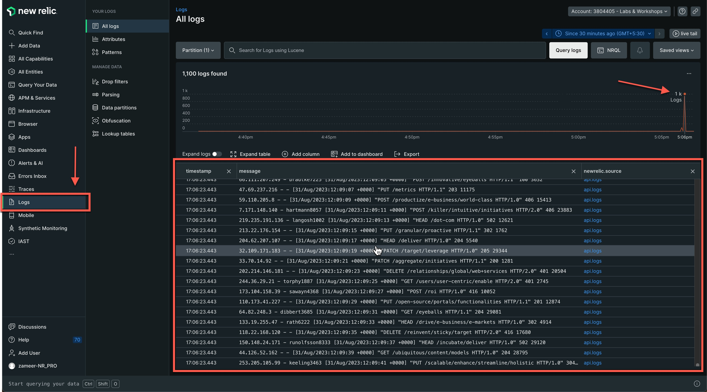
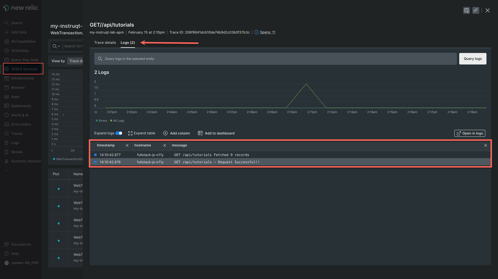

There are multiple ways to send the logs to New Relic, but we are going to leverage the New Relic Infrastructure Agent we installed earlier in this exercise. We will setup log forwarding via **logging.d** integration and will be forwarding sample logs that are generated in the file `/tmp/dummy.log`

Setup Log Forwarding
=====

### Step 1 - Create custom logging.yml file

Run the command below in the tab [button label="Terminal"](tab-1) tab to create a YAML configuration file under `logging.d` directory.

```run
touch /etc/newrelic-infra/logging.d/dummy-logging.yml
```
---

### Step 2 - Add configuration for logging.yml

Switch to the tab [button label="Config Editor"](tab-2), select your newly created YAML file (*dummy-logging.yml*) and add the following configuration. This selects the log files generated by our Node service.

```
logs:
  - name: dummy-logs
    file: /tmp/dummy.log # Path to a single log file
```
---

### Step 3 - Restart newrelic-infra agent

Switch to the terminal tab named [button label="Terminal"](tab-1)  and run the command below to restart the New Relic Infrastructure service.

```run
systemctl restart newrelic-infra.service
```

---
### Step 4 - Generate logs

In the terminal tab named [button label="Terminal"](tab-1), execute the following command to generate some dummy logs in the file named `dummy.log` ,

```run
/tmp/./flog -t log -n 2000 -d 0.5 -o /tmp/dummy.log -w
```

---
### Step 5 - Verify your logs in New Relic

Head over to your New Relic account, and select **Logs** from the side panel on the left and you should see your logs something like this.



> [!NOTE]
> It may take a few minutes before the data is shown on the dashboard

Bonus - Automatic Logs in Context For Distributed Tracing
=====

One of the other ways in which logs are collected is via APM. When we set up our APM agent in our node service, the APM automatically captures contextual logging from our service during runtime.

In the same app you had earlier, select **Distributed Tracing** in the main APM UI.
1. Choose any trace of API calls
2. Switch to *Logs* tab in the top, you should see the logs from that particular trace/API Call

