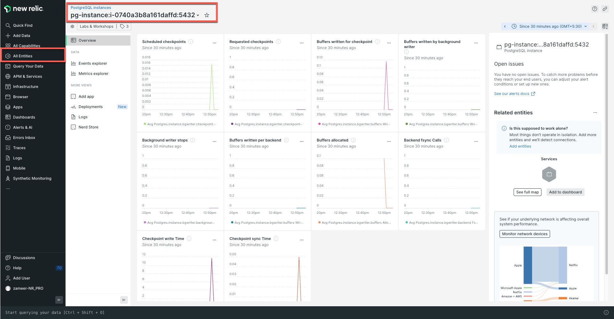

The New Relic PostgreSQL on-host integration, also known as OHI, enables you to receive and transmit inventory metrics from your PostgreSQL instance to the New Relic platform. By collecting and visualizing essential performance metrics, this integration provides valuable insights into your PostgreSQL instance's performance.

In this exercise, we will explore database instrumentation using New Relic. We have already installed and configured a PostgreSQL database, and now we will set up monitoring using New Relic's Infrastructure Agent and On-Host Integration.


Step 1. Install New Relic OHI for PostgreSQL
=

In tab [button label="Terminal"](tab-0), run the following command to install postgreSQL OHI

```run
sudo apt install nri-postgresql
```

Step 2. Create `postgresql-config.yml`
=

The OHI plugin installation adds a few sample configuration files for postgreSQL. In the same tab [button label="Terminal"](tab-0), run the command below to create a config file for postgres.

```run
sudo cp /etc/newrelic-infra/integrations.d/postgresql-config.yml.sample /etc/newrelic-infra/integrations.d/postgresql-config.yml
```


Step 3. Update PostgreSQL Configuration
=

Go to the [button label="Editor"](tab-1) tab and select the file we created in the previous step i.e. `postgresql-config.yml`.

Delete **ALL** the existing configuration from the file, and replace with the following,

```YML
integrations:
- name: nri-postgresql
  env:
    USERNAME: new_relic
    PASSWORD: 'instruqt'
    HOSTNAME: localhost
    PORT: "5432"
    COLLECTION_LIST: '["postgres"]'
    COLLECT_DB_LOCK_METRICS: "false"
    COLLECT_BLOAT_METRICS: "true"
    ENABLE_SSL: "false"
    TRUST_SERVER_CERTIFICATE: "false"
    TIMEOUT: "10"
  interval: 15s
  labels:
    env: production
    role: postgresql
  inventory_source: config/postgresql
```

Select **Save** to overwrite the configuration file.

Step 4. Restart Infrastructure Agent
=

Switch back to the [button label="Terminal"](tab-0) tab and execute the command below to restart our New Relic Infrastructure agent.

```run
systemctl restart newrelic-infra.service
```

Step 5. Verify Database entity in New Relic
=

Go to your New Relic account > [All Entities](https://one.newrelic.com/nr1-core?filters=(domain=%27INFRA%27%20AND%20type=%20%27POSTGRESQLINSTANCE%27))

and choose `On Host -> PostgreSQL Instance` from the left panel

> [!NOTE]
> It can take a few minutes before your data show up, it will look something like this



