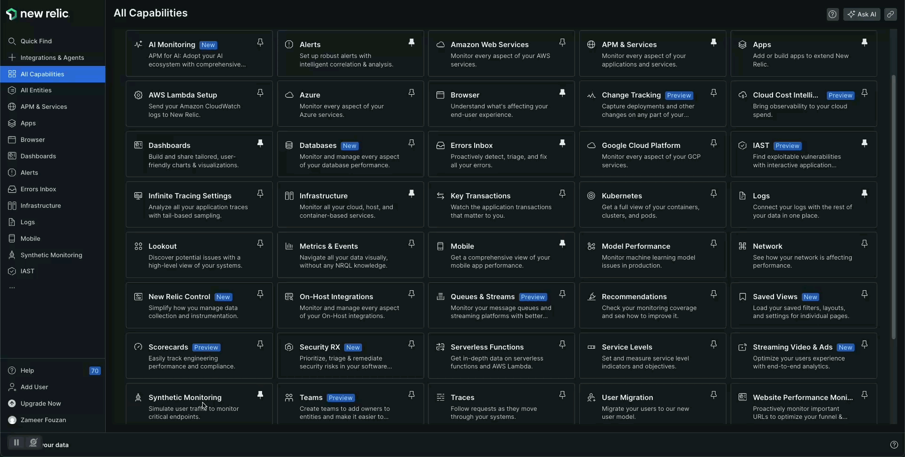
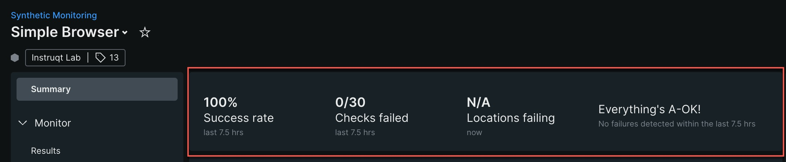
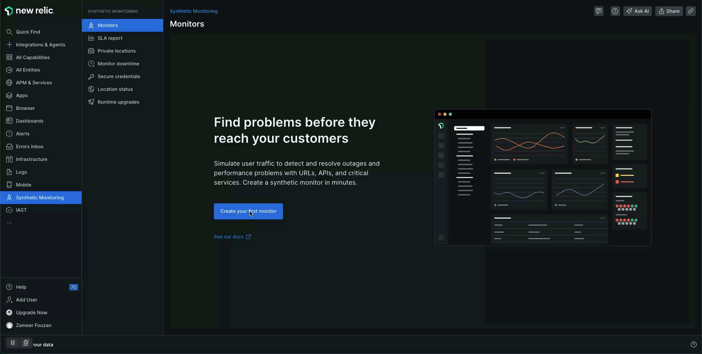
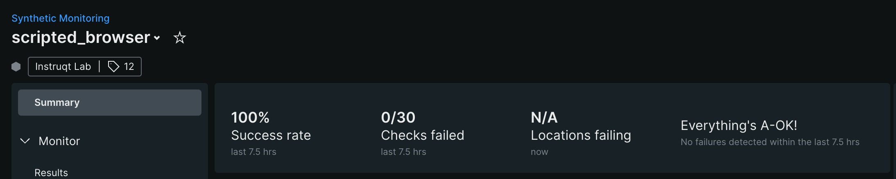

Synthetic monitoring is a useful tool for monitoring and testing your apps, allowing you to address issues before they affect your end users. There are various monitors that cover different aspects of a web application. In this document, we will cover two of the commonly used synthetic monitors:

1. Simple Browser (Basic)
2. Scripted Browser (Advanced)

Simple Browser
==

To add a monitor, go to New Relic > [Synthetic monitoring](https://one.newrelic.com/synthetics-nerdlets) to create your monitor.

Simple Browser check will test a full page load of a given URL and provides deep data insights like resource breakdowns and timelines.

---

To add a Simple Browser monitor

1. On Synthetics screen > Create Monitor.
2. Choose **Page Load Performance** from the list of monitors.
3. Add a "Name" for your monitor, and add the URL of your web app.
4. To get your previous URL, use this command to get your React Public URL in the [button label="Terminal"](tab-2) tab and paste the details in **URL (required)**.

```run
echo http://$HOSTNAME.$_SANDBOX_ID.instruqt.io:5182
```
if your application is not running, start the application again in [button label="Application Termincal"](tab-0) by running the following command

```run
mvn spring-boot:run
```

5. Choose **ONE** location from the list.
6. Click **Save**.



Wait for a few minutes for the checks to complete, you should be seeing success/failure results on the Summary screen of the monitor.



Scripted Browser checks
==

To add a monitor, go to New Relic >[Synthetic monitoring](https://one.newrelic.com/synthetics-nerdlets) to create your monitor.

Scripted browser monitors are used for more sophisticated, customized monitoring. You can create a custom script that navigates your website, takes specific actions, and ensures specific resources are present.

---

To add Scripted Browser monitor

1. On Synthetics screen > Create Monitor.
2. Choose **User flow / functionality** from the list of monitors.
3. Add a "Name" for your monitor.
4. Choose **ONE** location from the list by selecting **Select Location**.
5. In the **Write Script** section, replace all the contents in the window with the below provided JavaScript snippet.

---
Use this command again to get your React App's Public URL. **Important** - this is required to setup the monitor correctly!

```run
echo http://$HOSTNAME.$_SANDBOX_ID.instruqt.io:5182
```

> [!NOTE]
> You need to update/replace the URL in the script, before saving. Update the variable `URL` with your sandbox URL

Copy the below Selenium test script for Browser Checks

```javascript
// Selenium script truncated for brevity...
```

Validate first, then save the configurations and wait for a few minutes before the monitor runs the checks.



---

If all the steps have been followed correctly, it should appear as seen here.


