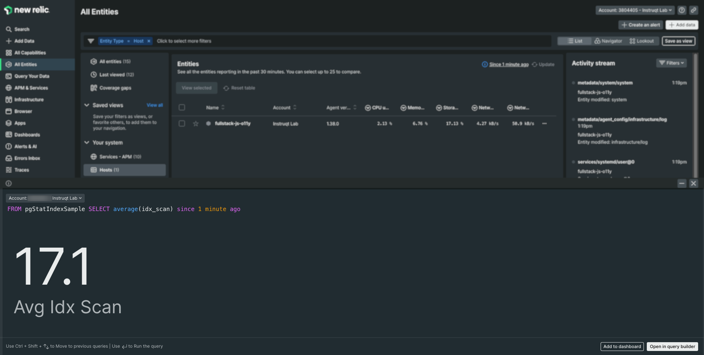

## Flex
What is Flex? Flex is an application-agnostic all-in-one low code/no code New Relic integration with which you can instrument any app that exposes metrics over a standard protocol HTTP, file, shell, and in a standard format i.e., JSON, plain text.

In this challenge, we will setup monitoring for a PostgreSQL database installed on our VM, with the help of NR-Flex

Step 1 - Configuration
=

File location `/etc/newrelic-infra/integrations.d/postgres-flex.yml`

Copy the below configuration and switch to [button label="editor"](tab-1) tab. Paste the below configuration in the file *postgres-flex.yml*

With this configuration, we are telling flex to connect to our Database and run a few specific queries that provides Database health information to us

```
# NOTE: 'database' is an experimental API at this time
# ref: https://github.com/newrelic/nri-flex/blob/master/docs/experimental/db.md
---
integrations:
  - name: nri-flex
    config:
      name: postgresExtendedFlex
      apis:
        - database: postgres
          db_conn: host=localhost port=5432 user=postgres password=root sslmode=disable
          logging:
            open: true
          db_async: true
          db_queries:
            - name: pgStatIndexSample
              run: select * FROM pg_stat_all_indexes
            - name: pgStatTableSample
              run: select * FROM pg_stat_all_tables
            - name: pgStatReplicationLagSample
              run: SELECT slot_name, database, active, pg_xlog_location_diff(pg_current_xlog_insert_location(), restart_lsn) AS ret_bytes FROM pg_replication_slots;
```

Step 2 - Debug Mode
=

Let's test the configuration, we will run Flex in debug mode. This verifies that the configuration is syntactically correct and provided options like *DB_CONN*, *DB_QUERIES* are working alright

```run
/opt/newrelic-infra/newrelic-integrations/bin/nri-flex -h -config_path postgres-flex.yml --pretty --verbose | grep --color -E '^|flex.counter.ConfigsProcessed*|flex.counter.EventCount*|flex.counter.EventDropCount.*|event_type.*|api.*|title.*|userId.*'
```

Step 3 - Validate Data with NRQL
=

We are going to user NRQL to analyze the events sent from FLEX

From the sidebar menu in the New Relic Platform, choose *Query your Data*

We are going to get average of index scans from `pgStatIndexSample` and `pgStatTableSample`.

Copy paste the following queries in the query builder
```
FROM pgStatIndexSample SELECT average(idx_scan) since 5 minutes ago
```

```
FROM pgStatTableSample SELECT average(idx_scan) since 5 minutes ago
```


